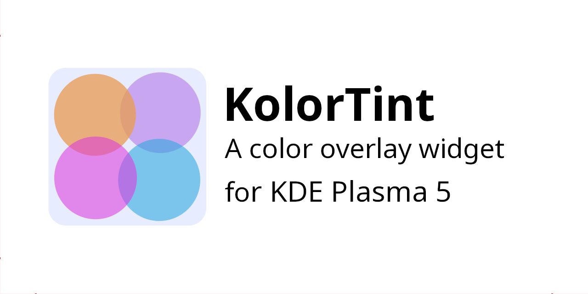

# KolorTint

**KolorTint is pre-release**

## About
KolorTint is a KDE widget that draws a translucent coloured overlay over your desktop. This is to help people with dyslexia, scopic sensitivity, and related conditions. It is the companion to [ColorTint](https://github.com/MattByName/color-tint), a GNOME extension with the same function.

### Links
* [GitHub Repository](https://github.com/MattByName/kolor-tint))
* [GitHub Releases](https://github.com/MattByName/kolor-tint/releases)

## Installation
KolorTine is not complete yet. Installation instructions will be included upon release.
## Features
* Set any RGB colour
* Custom translucency
* KolorTint remembers your chosen color, automatically saving it when you change it, and loading on launch
* Supports multiple monitor setup

## Contributing
Please do contribute if you want to change something or help out with one of the issues.

## Support, Feature Requests and Bug Reports

Please [raise an issue](https://github.com/MattByName/color-tint/issues/new) or raise a pull request. Alternatively, you can contact me via matrix at [@mattbyname:matrix.org](https://matrix.to/#/@mattbyname:matrix.org)

